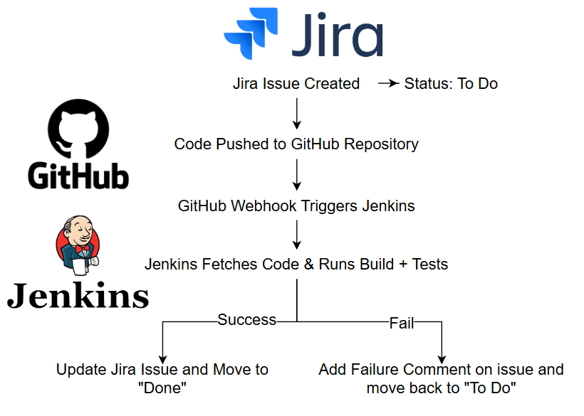

# Jira + Jenkins Docker Compose Setup

## Prerequisites

- Docker
- Docker Compose

## Services

- **Jira** (Atlassian Jira Software)
- **PostgreSQL** (Database for Jira)
- **Jenkins** (CI/CD Automation Server)

## Usage

1. Clone this repository:
   ```sh
   git clone <repo-url>
   cd <repo-folder>
   ```
2. Start the containers:
   ```sh
   docker-compose up -d
   ```
3. Access the services:
   - Jira: [http://localhost:8080](http://localhost:8080)
   - Jenkins: [http://localhost:8081](http://localhost:8081)

## Configuration

- Jira database settings:
  - Host: `postgres`
  - User: `jira`
  - Password: `jira`
  - Database: `jiradb`

## Stopping the Services

To stop the containers, run:

```sh
docker-compose down
```



- notes:
-- make sure to update all the jenkins plugins on the first rebot
-- Install the Jenkins for Jira (Official) app via Atlassian Marketplace
-- download Jira plugin in Jenkins (now its version 3.13)
-- install pipeline:groovy plugin
-- create an API Token in Jira
-- create Jenkins Credentials and configure jira in Jenkins with the credentials

-- expose the localhost jenkins with ngrok 
-- use the public jenkins url that ngrok created to use for a github webhook
